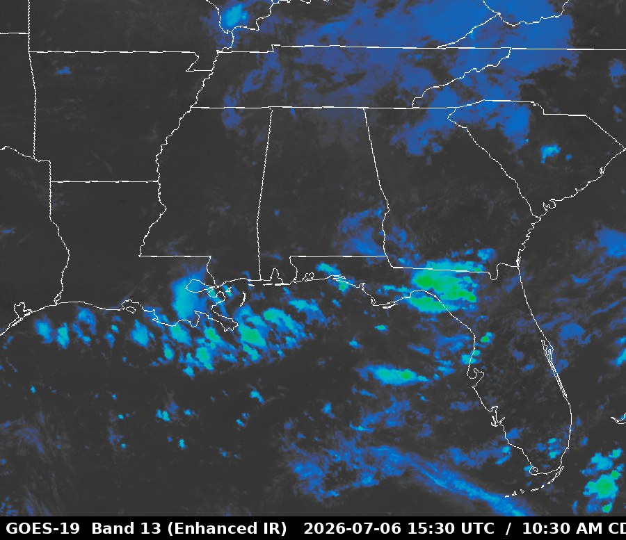
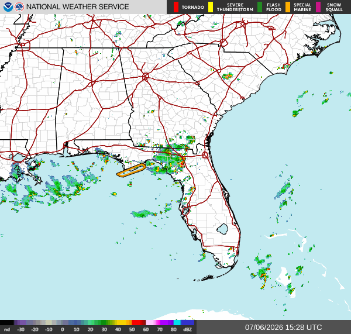
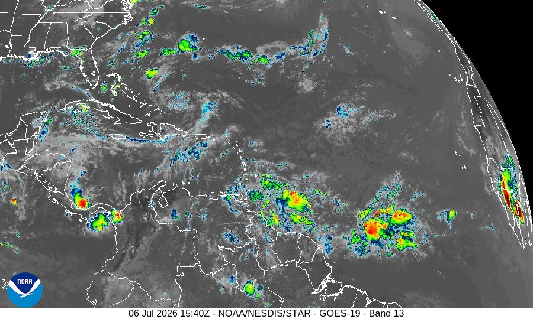

# 🛰️ GOES Weather Station

Turn a **Raspberry Pi + RTL-SDR** and a **Proxmox LXC** into a self-hosted weather
system: receive and decode **GOES-19 (GOES-East)** satellite imagery and the
**EMWIN** weather data stream, render a colorized infrared loop and NWS graphics
into **Home Assistant**, fire **severe-weather alerts**, archive products to
**S3 (MinIO)**, and monitor the whole thing in **Grafana**.


*Enhanced-IR (Band 13) loop, reprojected and cropped to a ~500 mi region, served to Home Assistant.*

---

## What you get

- 🎨 **Colorized enhanced-IR loop** of your region (geostationary → Plate-Carrée
  reprojection, cloud-top temperature color enhancement), as a Home Assistant camera.
- 🌩️ **NWS severe-weather alerts** parsed from EMWIN **VTEC** and pushed to HA as a
  sensor + notifications (Tornado / Severe T-storm / Flash-Flood, filtered to your NWS office).
- 🗺️ **Live NWS graphics tiles** — SPC Day-1 Convective Outlook, regional radar,
  tropical/surface analyses, CONUS IR — on a dedicated HA dashboard tab.
- 🗄️ **S3 archive** of decoded imagery (MinIO on ZFS).
- 📊 **Prometheus + Grafana** dashboards for signal quality (Viterbi/RS/packets) and host health.

<p align="center">
  
  
</p>

---

## Architecture

The design **splits the work across two machines** so the SD-card Pi only does the
light, hardware-bound job (demodulation) and a Proxmox LXC does the heavy image
processing. See [docs/architecture.md](docs/architecture.md) for the full diagram.

```
 1694.1 MHz HRIT (GOES-19)
     │  RTL-SDR (bias-tee) + SAWbird+ GOES LNA + L-band antenna
     ▼
┌──────────────────────┐   VCDU packet stream    ┌────────────────────────────┐
│ Raspberry Pi         │  tcp://pi:5004 (nanomsg) │ Proxmox LXC (goes-proc)    │
│  • goesrecv (demod)  │ ───────────────────────▶ │  • goesproc (decode)       │
│  • ~light CPU        │                          │  • IR loop / EMWIN alerts  │
└──────────────────────┘                          │  • graphics / S3 upload    │
                                                   └───────────┬────────────────┘
              ┌───────────────────────┬────────────────────────┴──────┐
              ▼                       ▼                                ▼
        MinIO (S3 on ZFS)     Home Assistant                   Prometheus/Grafana
        imagery archive       cameras + alerts                 signal + host metrics
```

Why split it? An RTL-SDR HRIT demod is light, but `goesproc` rendering full-disk
imagery with map overlays (and generating loops) is CPU-heavy and bursty. On a Pi 4
doing both, CPU sat at ~78%; moving `goesproc` to an LXC dropped the Pi to ~22% and
freed headroom for loop generation. The Pi streams its decoded packet feed over the
network — trivial bandwidth.

---

## Hardware

| Part | Notes |
|---|---|
| **Raspberry Pi 4** (2 GB+) | Runs `goesrecv` (demod). Any always-on Linux SBC works. |
| **RTL-SDR with bias-tee** | e.g. Nooelec SMArTee / RTL-SDR Blog V3/V4. Bias-tee powers the LNA. |
| **SAWbird+ GOES LNA** | 1688 MHz SAW filter + LNA. Essential for L-band. |
| **L-band antenna** | Dish + feed, or a purpose-built GOES patch/helix, aimed at GOES-East. |
| **Proxmox host** (or any Linux box) | Runs the processing LXC + MinIO. A VM/container elsewhere is fine. |

> GOES-East HRIT is at **1694.1 MHz**. GOES-West is 1686.6 MHz. The tuner must
> reach L-band (the Nooelec "XTR" / RTL-SDR Blog V3/V4 do).

---

## Build walkthrough

Copy `setup.env.example` → `setup.env` and fill in your hosts, secrets, and location.
Everything is parameterized from there. IPs in the examples are the author's LAN
(RFC1918) — adjust to yours.

### 1 · Raspberry Pi — SD-longevity + hardening + demod
```bash
scp pi-goes-ns/*.sh youruser@PI:~/ && ssh youruser@PI
sudo bash phase1-sd-hardening.sh && sudo reboot   # log2ram, tmpfs, journald caps, fstrim
sudo bash phase2-hardening.sh                      # ufw, key-only SSH, unattended-upgrades, fail2ban
sudo bash phase4-goesrecv-build.sh                 # build goestools, blacklist DVB driver, udev rule
sudo bash phase4-goesrecv-config.sh                # goesrecv.conf + systemd service (needs the SDR attached)
sudo bash phase6-metrics.sh                        # node + statsd exporters
```
`goesrecv` demodulates HRIT and publishes VCDU packets on `tcp://0.0.0.0:5004`.
Watch its stats: a healthy lock shows Viterbi errors well under ~2000 and packets flowing.

### 2 · Proxmox LXC — decode, loops, alerts, graphics, upload
Create a Debian LXC (a couple of cores, 2–4 GB), then:
```bash
scp -r lxc-goes-proc/* root@LXC:/root/goes/ && ssh root@LXC
cd /root/goes && bash build-goestools.sh          # ⚠ needs libproj-dev or goesproc rejects map overlays
GOES_S3_SECRET=… HA_TOKEN=… bash deploy.sh         # goesproc + timers + secrets from env
# point goesrecv on the Pi at tcp://0.0.0.0:5004 and open its firewall to the LXC
```
This runs `goesproc` (subscribing to the Pi), the **IR loop** generator, the **EMWIN
alert** daemon, the **graphics** pipeline, an S3 uploader, and a tiny web server that
serves the loop + graphics to Home Assistant.

### 3 · Object storage (MinIO on ZFS)
Create a scoped bucket + least-privilege user for the uploader, and enable Prometheus
metrics — see [monitoring/minio-metrics.md](monitoring/minio-metrics.md). Only decoded
**imagery** is archived; EMWIN text/graphics are consumed locally and pruned.

### 4 · Home Assistant
Entities are created against the HA API with a long-lived token (no YAML edits needed):
- `camera.goes19_ir_loop` — the animated enhanced-IR loop (served through HA's camera
  proxy, so it works remotely).
- `sensor.goes_wx_kmob` — active NWS hazards for your office, with notifications.
- `camera.wx_*` — the graphics tiles.

See [home-assistant/README.md](home-assistant/README.md) and
[home-assistant/dashboard-cards.yaml](home-assistant/dashboard-cards.yaml).
`home-assistant/ha_wslib.py` is a dependency-free HA WebSocket client used to create
cameras, rename entities, and add dashboard views/tabs programmatically.

### 5 · Monitoring
Append [monitoring/prometheus-jobs.yml](monitoring/prometheus-jobs.yml) to your
Prometheus config and import the Grafana dashboards under `monitoring/grafana/`.
The receiver dashboard graphs Viterbi/RS errors, packet rate, gain, frequency offset,
plus host CPU/temp/memory and the upload-spool backlog.

---

## Lessons learned (the stuff that isn't in the man pages)

- **Build goestools *with* `libproj-dev`** or `goesproc` rejects any handler that draws
  map overlays with a cryptic error.
- **HRIT ≠ everything.** GOES-19's HRIT downlink carries Full Disk + Mesoscale + EMWIN,
  but **not** the CONUS ABI sector (that's on the higher-rate GRB feed). Regional loops
  come from cropping Full Disk.
- **Enhanced-IR color needs a calibrated threshold.** Band-13 output is 8-bit brightness,
  and in a *calm* scene cloud tops only reach ~140/255 — so a color ramp that starts at
  180 shows nothing but gray. Histogram the data first: clear-sky sits ~48, clouds
  ~60–143 (up to 255 in deep convection). Start the ramp just above clear-sky. The map
  overlays are baked in at pure white (255), so map the top of the ramp to white too or
  your state borders turn magenta.
- **EMWIN graphics are a fixed, scheduled set.** Products issue on NWS schedules (SPC
  outlooks a few times a day, surface analyses 3-hourly), so a short capture window won't
  see them all. Map products by their catalog IDs (e.g. `MODDY1US` = SPC Day-1 outlook,
  `RADSTHES` = SE radar) using the official
  [EMWIN Data Capture Catalog](https://www.weather.gov/media/emwin/EMWIN_Image_and_Text_Data_Capture_Catalog_v1.3n.pdf).
- **Some RTL-SDR dongles (E4000) can hard-latch** into a USB enumeration hang (`error -71`)
  after `rtl_test -t`. No software reset clears it — not `uhubctl` (hubs often don't gate
  VBUS), not a warm reboot (VBUS stays powered), not an xHCI rebind. Only a physical
  replug. Don't run `rtl_test -t`; let `goesrecv` drive the device.
- **Protect the SD card.** `log2ram`, tmpfs for the product spool, capped journald, and
  weekly `fstrim` keep write amplification down. Decoded products live in RAM/short-lived
  storage and are shipped to S3, not written and rewritten on the card.

---

## Repository layout

```
pi-goes-ns/       Raspberry Pi: SD/security hardening + goesrecv (demod) [+ optional DNS]
lxc-goes-proc/    Proxmox LXC: goesproc, IR loop, EMWIN alerts + graphics, S3 upload
monitoring/       Prometheus scrape jobs + Grafana dashboards
home-assistant/   Lovelace cards + dependency-free HA WebSocket helper
docs/             Architecture + data-flow
setup.env.example Central host / secret / site parameters
```

## Security

No credentials are committed. All secrets live in gitignored files
(`setup.env`, `/etc/goes/rclone.conf`, `/etc/goes/ha.env`); only `*.example`
templates are tracked.

## Credits

Built on the excellent [**goestools**](https://github.com/pietern/goestools) by Pieter
Noordhuis. Weather data © NOAA/NWS (public domain). Inspired by the r/RTLSDR and USRadioguy
GOES community.

## License

[MIT](LICENSE) — do what you like; no warranty.
